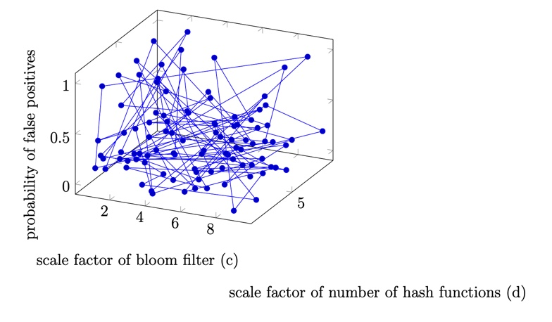

# cs130a_pa1

Document for PA1
By: Jennifer Park, 2-10-22

I set a seed using current time and feed it a random number generator to get the same evenly distributed pseudo-random numbers. This is in strToInt.cpp. Each character in the string is sequentially multiplied by the consistently-generated pseudo-random number to prevent collisions. This makes it unlikely that two different strings are converted into the same int. 

I generate hash functions on a uniform random distribution by multiplying unique ints by a pseudo-random number and adding it to another pseudo-random number. Then, I take the modulo size (size and q for bloom filter and aux hash filter, resp.). 

I find the size of the aux hash table by multiplying the size of the bloom filter by the scale factor (n*c) and the next prime number larger than that is used for the hash table that stores the removed items. I did this because the time complexity of a successful search is 1+lambda and that for an unsuccessful search is 1+lambda/2-lamdbda/(2n) where lambda=n/m. So with more buckets, more memory is used, but the time complexity will still be lower and so lookups are faster. 

Increasing the number of insertions to 10000 lowered the number of false positives significantly and fixed a lot of the issues I had. This was better for the false positives than scaling the number of hash functions. Graph is heavily weighted to the scale of the bloom filter (larger scale factor is better), which means it changes the probability of false positives depending on what c is. This is because collisions are unlikely with my hash functions B). 

I use p = 0.4 because it’s faster and random float values from 0 to 10 for c and d. See “graphs” and “outputs.”

